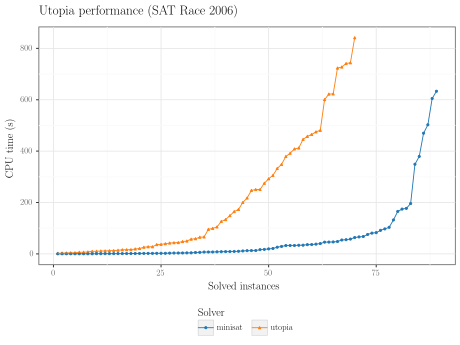
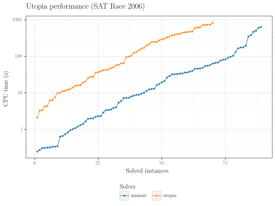
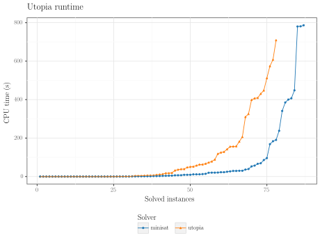
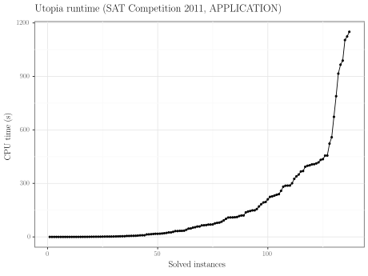
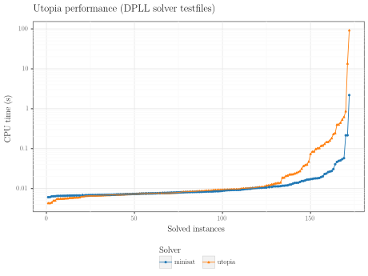
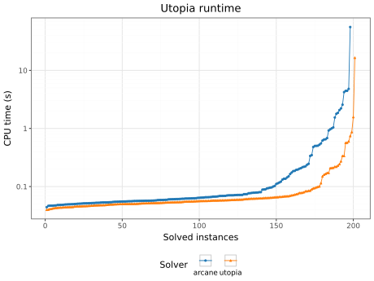

<p align="center">
    
</p>

# _Utopia_

Utopia is a modern and easy to read CDCL SAT solver written in Rust.

## Techniques

### ⚔️ Conflict-driven clause learning

The foundational algorithm of _Utopia_ is conflict driven clause learning. The following techniques are implemented in
the base algorithm:

- **2 Watched Literals** for efficient unit propagation. The watches are stored implicitly in the first two variables.
- **Non-chronological backtracking** is a key improvement over DPLL. When used in conjunction with the 2 Watched
  Literals scheme, backtracking can be performed without any additional computation.
- **First-UIP Clause Learning** is a method for analysing conflict clauses by iteratively walking back along the trail,
  similar to MiniSat [1]
- **Blocking literals** are used to efficiently check whether a clause is satisfied under a given partial assignment,
  without having to read from the clause memory. Setting the blocking literal is done at almost no cost during watch
  updates. [2]

### 🍯 Literal Blocking Distance

As first pioneered by Glucose [8], _Utopia_ calculates the **Literal Block Distance** of learned clauses as the number
of unique decisions levels in the clause. They are then used during clause deletion and restart scheduling. The
calculation is implemented efficiently by keeping track of decision levels during propagation and decreases the LBD
values of clauses seen during analysis to prevent good clauses from going undetected.

### 🔁 Restarts

Restarts significantly improve the performance of CDCL Solvers by mitigating the heavy-tailed runtime
distribution [2]. _Utopia_ implements the following restart policies:

- **Fixed Interval Policy** schedules a restart after a fixed number of conflicts (700) [2]
- **Geometric** performs restarts after a geometrically increasing number of conflicts [2]
- **Luby** uses the Luby sequence [10] to schedule restarts.
- **Glucose-EMA** is a dynamic restart policy that improves on the LBD based restart policy [8] of Glucose. The goal is
  to do more restarts while the LBDs of learned clauses are bad and not to interrupt the solver shortly before it finds
  a satisfying assignment. It uses several exponential moving averages [2] and consists of the following
  procedures:
    - _**Forcing Restarts**_: If the short-term LBD is significantly higher than the long-term LBD, the currently
      learned clauses are considered to be less beneficial and thus, a restart is forced.
    - _**Blocking Restarts**_: If the average number of assigned variables in the recent past is considerably higher
      than the long-term average, the solver may be close to finding a satisfying assignment. In this case, no restarts
      are performed.

  All exponential moving averages use a special initialisation technique as used in CaDiCaL initialise quicker [2].

The benefits of performing restarts can be further enhanced by using **phase saving**: Whenever a variable is assigned,
the value it was assigned to is saved as this variable's phase. If the
variable is subsequently selected as a branching variable, the value last saved as the phase is reassigned.

### 🗑️ Clause Deletion

As described in [8], _Utopia_ deletes an estimated half of the learned clauses every 2000+300*x conflicts, where x is
the number
of deletions
performed so far. Therefore, the clauses are sorted according to their LBD in order to prioritise the deletion of
clauses with a higher LBD. However, neither reason clauses nor unit clauses or clauses with an LBD value of two are
deleted.

### 🗜️ Inprocessor

_Utopia_ uses inprocessing to benefit from CNF minimisation without adding the constant cost of a preprocessor. To
minimize overhead, inprocessing is scheduled immediately after restarts and is interrupted to ensure it always takes up
a
constant portion of runtime (10%). Currently, this inprocessing procedure only implements bounded variable elimination.
Inprocessing steps are recorded and considered during reconstruction of the satisfying model, using the methods
described
in [4].

Additionally, we use learned clause minimisation as introduced in MiniSat 1.13 [7] to simplify the learned clauses
already during their creation.

### 📝 Proof Logging

Proofs of unsatisfiability can be logged using a command line flag. They log clauses learned during CDCL, during
inprocessing as well as clause deletions. A DRUP-capable proof checker (like DRAT-trim [9]) is sufficient to check the
proofs, including inprocessing.

### 🎲 Heuristics

_Utopia_ allows users to choose a variable selection heuristic to guide the solving process. The available heuristics
include:

| Heuristic | Description                                                                                                                                                                              |
|:----------|:-----------------------------------------------------------------------------------------------------------------------------------------------------------------------------------------|
| Basic     | Choosing the first unassigned variable.                                                                                                                                                  |
| Decay     | _Decaying unassignments_: <br/>Prefer recently unassigned variables (as used in our previous DPLL based solver _Arcane_).                                                                |
| VMTF      | _Variable Move to Front_: <br/>Prefers variables that have recently been part of a conflict clause by moving variables involved in the last conflict to the front of the priority queue. |
| VSIDS     | _Variable State Independent Decaying Sum_: Favours variables that occurred frequently in recent conflict clauses by calculating an exponential moving average for each variable.         |

The VSIDS heuristic is implemented efficiently as *EVSIDS* [3] by increasing the bump amount exponentially to avoid
having to decay all other variables on each conflict. Periodically, the bump amount and priorities are rescaled to stay
within floating point limits. We use a lazy heap based priority queue is used to choose the next branching literal.

## Installation

To use the CLI, you need to have [Rust](https://www.rust-lang.org/tools/install)
and [Cargo](https://doc.rust-lang.org/cargo/getting-started/installation.html) installed on your system.

1. Clone the repository:

   ```bash
   git clone git@github.com:SamuelLess/utopia.git
   ```

2. Navigate to the project directory:

   ```bash
   cd utopia
   ```

3. Build the CLI:

   ```bash
   cargo build --release
   ```

4. Run the CLI:
   ```bash
   ./target/release/utopia --help
   ```

## Usage

To run _Utopia_, use the following command:

```bash
./target/release/utopia [OPTIONS] <file>
````

The output is valid DIMACS itself and can be piped to other programs if desired.

### Required Argument

- `<file>`: Path to the SAT instance file in DIMACS CNF format. _Utopia_ transparently supports gzipped CNF files.

### Options

- `-p, --proof <PROOF>`: Path to put proof file
- `--heuristic <HEURISTIC>`: Variable selection heuristic
    - decay, true-first, vmtf, vsids
    - default: vsids
- `-r, --restart-policy <RESTART_POLICY>`: Restart policy
    - fixed-interval, geometric, luby, glucose-ema, no-restarts
    - default: glucose-ema
- `--no-inprocessing`: Disable inprocessing
- `--progress-printing <PROGRESS_PRINTING>`
    - short, medium, long, off
    - default: medium
- `-h, --help`: Print help
- `-V, --version`: Print version

### Example

The following example assumes that you are in the `utopia` directory.
It solves the SAT instance in `./testfiles/lecture_testfiles/unsat/pret150_75.cnf` using the `vsids` heuristic and
writes the solution to `solution.txt`:

```bash
./target/release/utopia --heuristic vsids -o solution.txt ./testfiles/lecture_testfiles/unsat/pret150_75.cnf
```

## Benchmarks

<table>
<tr>
    <th colspan="2">
        <h3 style="margin: 1px">SAT Race 2006</h3>
    </th>
</tr>
<tr>
    <td style="text-align: center; width: 50%">    
        
        <br>
        Linear scale
    </td>
    <td style="text-align: center; width: 50%">    
        
        <br>       
        Logarithmic scale
    </td>
</tr>
</table>

<table>
<tr>
    <th>
        <h3 style="margin: 1px">
            SAT Competition 2009 <br> (Crafted Instances)
        </h3>
    </th>
    <th>
        <h3 style="margin: 1px">
            SAT Competition 2011 <br> (Application Instances)
        </h3>
    </th>
</tr>
<tr>
    <td style="width: 50%">
        
    </td>
    <td style="width: 50%">
        
    </td>
</tr>
</table>

<table>
<tr>
    <th colspan="2">
        <h3 style="margin: 1px">DPLL solver testfiles ("lecture testfiles")</h3>
    </th>
</tr>
<tr>
    <td style="text-align: center; width: 50%">    
        
        <br>
        Utopia vs. Minisat
    </td>
    <td style="text-align: center; width: 50%">    
        
        <br>       
        Utopia vs. Arcane
    </td>
</tr>
</table>

## References

<p style="padding-left: 1.5em; text-indent: -1.35em">[1]  N. Eén and N. Sörensson, ‘An Extensible SAT-solver’, in Theory and Applications of Satisfiability Testing, vol.
2919, E. Giunchiglia and A. Tacchella, Eds., in Lecture Notes in Computer Science, vol. 2919. , Berlin, Heidelberg:
Springer Berlin Heidelberg, 2004, pp. 502–518. doi: 10.1007/978-3-540-24605-3_37.
</p>

<p style="padding-left: 1.5em; text-indent: -1.35em">[2] A. Biere and A. Fröhlich, ‘Evaluating CDCL Restart Schemes’, presented at the Proceedings of Pragmatics of SAT 2015
and 2018, pp. 1--17. doi: 10.29007/89dw.
</p>

<p style="padding-left: 1.5em; text-indent: -1.35em">[3] A. Biere and A. Fröhlich, ‘Evaluating CDCL Variable Scoring Schemes’, in Theory and Applications of Satisfiability
Testing -- SAT 2015, vol. 9340, M. Heule and S. Weaver, Eds., in Lecture Notes in Computer Science, vol. 9340. , Cham:
Springer International Publishing, 2015, pp. 405–422. doi: 10.1007/978-3-319-24318-4_29.
</p>

<p style="padding-left: 1.5em; text-indent: -1.35em">[4] M. Järvisalo, M. J. H. Heule, and A. Biere, ‘Inprocessing Rules’, in Automated Reasoning, vol. 7364, B. Gramlich, D.
Miller, and U. Sattler, Eds., in Lecture Notes in Computer Science, vol. 7364. , Berlin, Heidelberg: Springer Berlin
Heidelberg, 2012, pp. 355–370. doi: 10.1007/978-3-642-31365-3_28.
</p>

<p style="padding-left: 1.5em; text-indent: -1.35em">[5] N. Sörensson and A. Biere, ‘Minimizing Learned Clauses’, in Theory and Applications of Satisfiability Testing - SAT
2009, vol. 5584, O. Kullmann, Ed., in Lecture Notes in Computer Science, vol. 5584. , Berlin, Heidelberg: Springer
Berlin Heidelberg, 2009, pp. 237–243. doi: 10.1007/978-3-642-02777-2_23.
</p>

<p style="padding-left: 1.5em; text-indent: -1.35em">[6] N. Sörensson and N. Eén, ‘MiniSat and MiniSat++ 1.0 – SAT Race 2008 Editions’, presented at the SAT Race 2008,
May 2008. [Online]. Available: https://baldur.iti.kit.edu/sat-race-2008/descriptions/solver_25.pdf
</p>

<p style="padding-left: 1.5em; text-indent: -1.35em">[7] N. Sörensson and N. Eén, ‘MiniSat v1.13 - A SAT Solver with Conflict-Clause Minimization’, 2005. Accessed:
Mar. 21, 2024. [Online].
Available: https://www.semanticscholar.org/paper/MiniSat-v1.13-A-SAT-Solver-with-Conflict-Clause-S%C3%B6rensson-E%C3%A9n/94a25711f91bc18d666ad343024c1c4ed6e62a8e
</p>

<p style="padding-left: 1.5em; text-indent: -1.35em">[8] G. Audemard and L. Simon, ‘On the Glucose SAT Solver’, Int. J. Artif. Intell. Tools, vol. 27, no. 01, p.
1840001,
Feb. 2018, doi: 10.1142/S0218213018400018.
</p>

<p style="padding-left: 1.5em; text-indent: -1.35em">[9] M. J. H. Heule, ‘The DRAT format and DRAT-trim checker’. arXiv, Oct. 19, 2016. doi: 10.48550/arXiv.1610.06229.
</p>

<p style="padding-left: 1.5em; text-indent: -1.35em">[10] M. Luby, A. Sinclair, and D. Zuckerman, ‘Optimal speedup of Las Vegas algorithms’, in [1993] The 2nd Israel Symposium on Theory and Computing Systems, Jun. 1993, pp. 128–133. doi: 10.1109/ISTCS.1993.253477.
</p>
## License

This project is licensed under the GPL License - see the [LICENSE](LICENSE) file for details.

## Authors

Written by Niels Glodny, Samuel Leßmann and Christian Wagner. Utopia was created during the course 'SAT Solving' held by Jan Johannsen at LMU in 2023.
